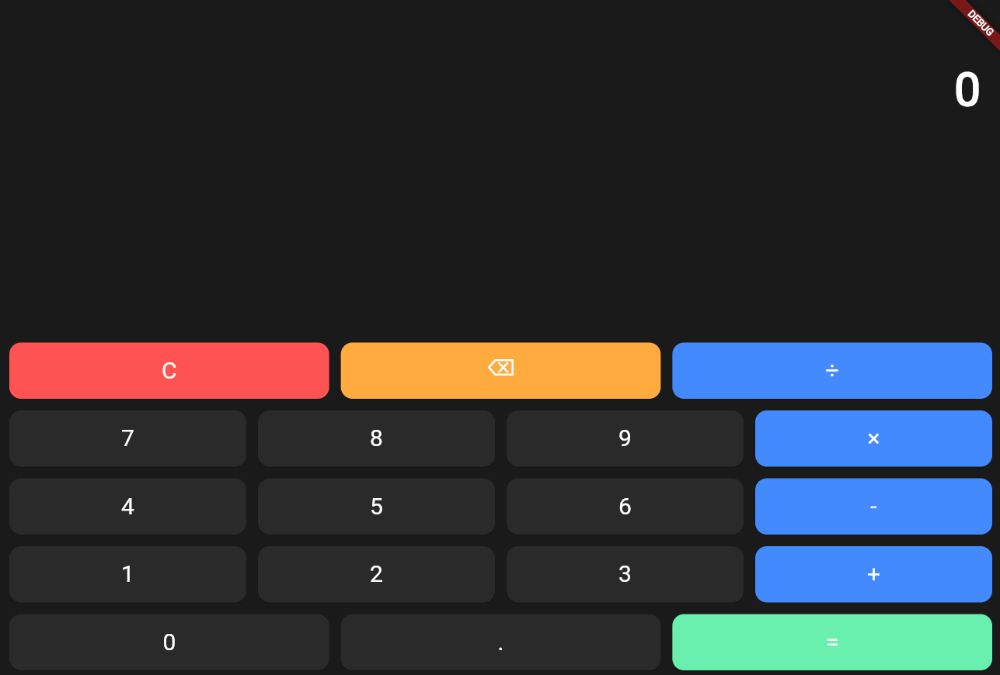

# Calculator App 🧮

A modern calculator application built with Flutter, featuring a dark theme and intuitive user interface.

## Features ✨

- Basic arithmetic operations: addition ➕, subtraction ➖, multiplication ✖️, division ➗
- Decimal number support 🔢
- Clear (C) and backspace (⌫) functions 🧹
- Modern dark theme design 🌙
- Responsive button layout 📱

## Screenshots 📸



## Getting Started 🚀

### Prerequisites

- Flutter SDK (3.0.0 or higher)
- Dart SDK (3.0.0 or higher)

### Installation

1. Clone the repository:
```bash
git clone <repository-url>
```

2. Navigate to the project directory:
```bash
cd calculator
```

3. Get the dependencies:
```bash
flutter pub get
```

4. Run the app:
```bash
flutter run
```

## Project Structure 📁

```
lib/
├── main.dart              # App entry point 🎯
└── calculator_screen.dart # Calculator UI and logic 🧮
```

## Tech Stack 🛠️

- **Framework**: Flutter
- **Language**: Dart
- **Platform**: Android 📱, iOS 🍎, Web 🌐, Desktop 💻

## License 📄

This project is licensed under the MIT License - see the [LICENSE](LICENSE) file for details.

## Author 👤

Created with Flutter 💙
